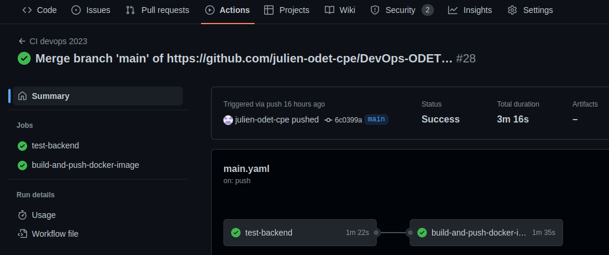
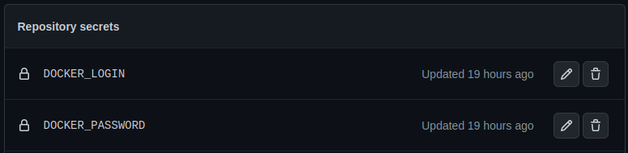
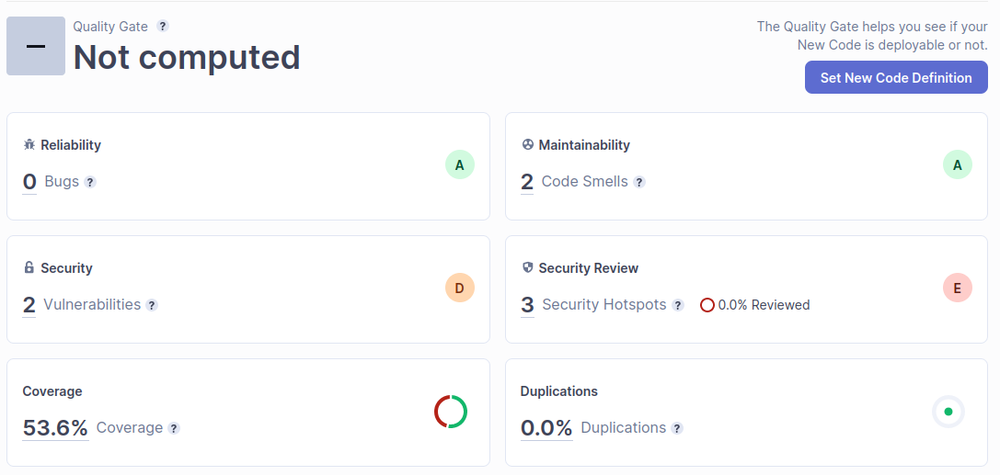

# **TP2 DevOps - Compte rendu**

Filière IRC - 4ème année - Promotion 2024

## Auteurs :
- Julien ODET
- Alex PERRAUD

---

## **Setup GitHub Actions**

On build et run les tests (à l'endroit du *pom.xml*) :
```
mvn clean verify
```

**2-1) What are testcontainers ?**

Ce sont des bibliothèques Java que l'on charge avec Maven et qui permettent d'exécuter des conteneurs Docker pendant les tests.

Nous créons ensuite le fichier *main.yml* dans le dossier *.github/workflows*.

**2-2) Document your Github Actions configurations.**

On constate que tout fonctionne :


On ajoute nos logins DockerHub aux variables d'environnement GitHub Actions :


On complète le *main.yaml* pour que nos images Docker soient build dans notre pipeline GitHub Actions.

On ajoute ensuite la partie publications.

Voir le fichier *main.yml* commenté.

---

## **Setup Quality Gate**

**2-3) Document your quality gate configuration.**

Après avoir créé un compte gratuit SonarCloud et une organisation, nous avons ajouté SonarCloud avec nos clés au fichier *main.yml* dans le *Build and test with Maven*.

On peut voir que l'analyse fonctionne :
