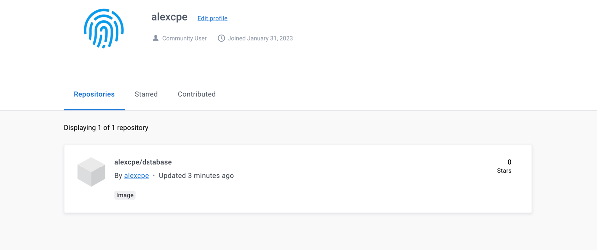

# TP DevOps - Compte rendu

Filière IRC - 4ème année - Promotion 2024

## Auteur :
- Julien ODET
- Alex PERRAUD

---

## Database
Il s'agit de build l'image *postgres:14.1-alpine*.
Pour cela, on reprend le Dockerfile qui défini l'image source ainsi que les variables d'environment (nom de la base de données, le user, le mot de passe), puis on build à l'aide de la commande :
```
docker build -t pgdb .
```
> NB: le point à la fin de la commande signifie que l'on utilise le Dockerfile qui est là où la commande est exécutée.

Ensuite, on créé le network correspondant avec la commande :
```
docker network create app-network
```

On lance notre application en précisant bien le network avec la commande :
```
docker run --name pgdb -p 5432:5432 -v volume:/var/lib/postgresql/data --net=app-network -d  pgdb
```
> NB: Le volume sert à obtenir une persistance des données.

Enfin, on build l'adminer avec la commande :
```
docker build -t adminer .
```

Puis, on le lance avec la commande :
```
docker run -p "8090:8080" --net=app-network --name=adminer -d adminer
```

On accède alors à l'interface de la connexion à la base de données via localhost:8090.

## Backend API


## Http server


## Questions
### 1-1) Document your database container essentials: commands and Dockerfile.
> 

### 1-2) Why do we need a multistage build? And explain each step of this dockerfile.
> 

### 1-3) Document docker-compose most important commands. 1-4 Document your docker-compose file.
>

### 1-5) Document your publication commands and published images in dockerhub.
>


alexdev@MC-G7V9THG2MC java % docker run --name pgdb -p 5432:5432 -v volume:/var/lib/postgresql/data --net=app-network -d  pgdb


docker run --net=app-network -p 8090:8080 --name pgadmin -d adminer

FROM openjdk:17-jre
COPY Main.class /
RUN java Main
java :
docker run --name javabackendapi -p 8080:8080 --net=app-network -d  javabackendapi
docker build . -t javabackendapi            
// dans application.yml :
datasource:
url: jdbc:postgresql://pgdb:5432/db
username: usr
password: pwd
http :
<VirtualHost *:80>
ProxyPreserveHost On
ProxyPass / http://javabackendapi:8080/
ProxyPassReverse / http://javabackendapi:8080/
</VirtualHost>
docker build . -t http        
docker run --name http -p 80:80 --net=app-network -d  http


docker tag tp-docker-database  alexcpe/database:1.0
docker push alexcpe/database:1.0
